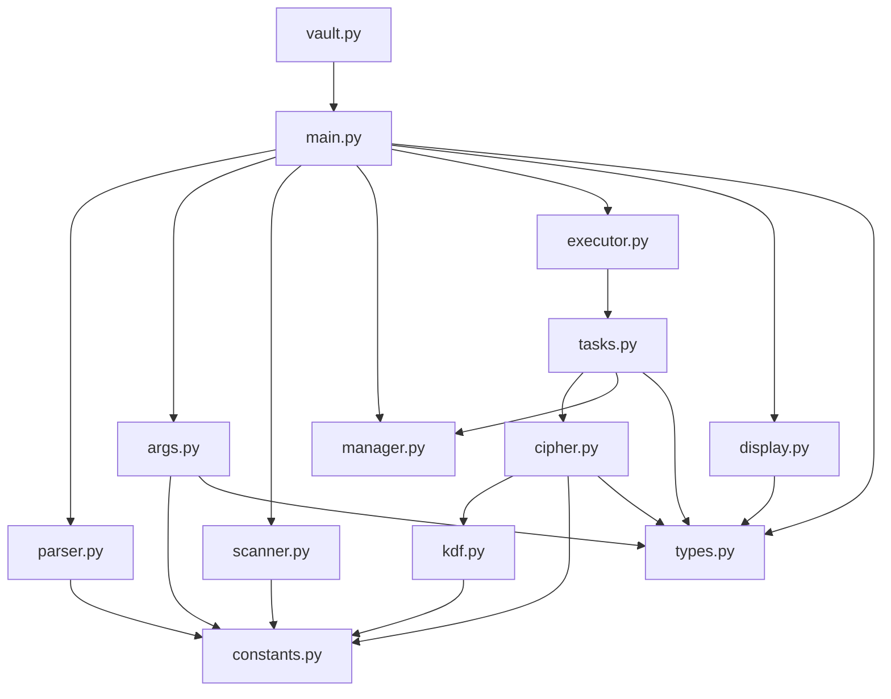
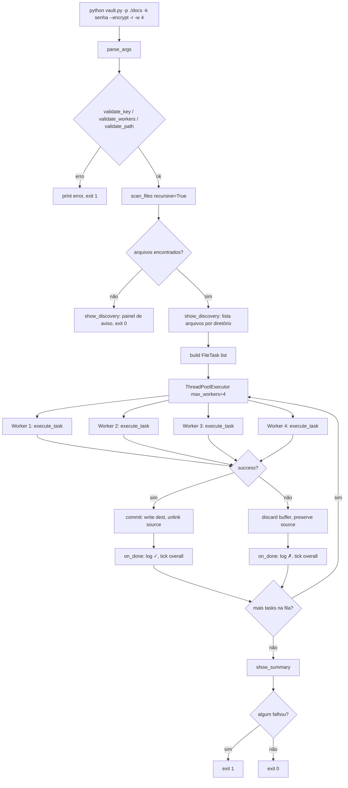
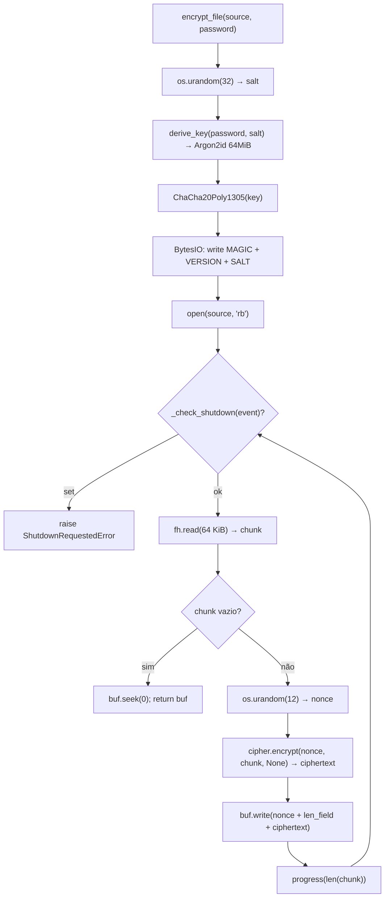
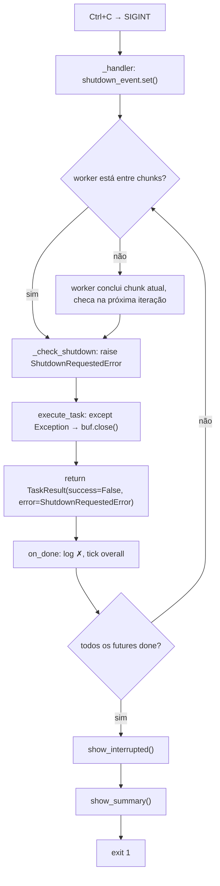
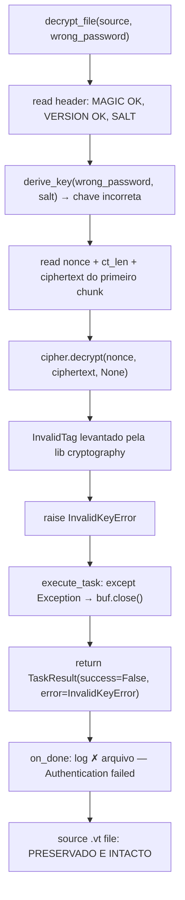

# CLAUDE.md — Documentação Mestre do Projeto VaultCrypt

> **Propósito:** Este documento é a fonte única de verdade do projeto VaultCrypt.
> Contém todo o conhecimento necessário para compreender, manter, evoluir e
> reconstruir integralmente o projeto sem depender de qualquer contexto externo.
>
> **Fonte:** Gerado a partir da análise completa do histórico de conversas,
> código-fonte e artefatos do projeto.

---

## 1. Visão Geral do Projeto

### Objetivo Principal

VaultCrypt é uma ferramenta de linha de comando (CLI) em Python para criptografar
e descriptografar arquivos de texto (`.txt` e `.md`) de forma segura, eficiente
e resiliente a falhas, operando exclusivamente sobre o sistema de arquivos local.

### Problema que Resolve

O usuário precisa proteger arquivos de texto locais contra acesso não autorizado,
com requisitos de segurança estritos:

- Nenhum dado sensível deve permanecer em disco como artefato recuperável após a
  operação (preocupação com recuperação forense).
- A chave nunca deve ser armazenada pela ferramenta.
- Cada arquivo deve ser independente: falha em um não afeta outros.
- Arquivos originais devem ser preservados integralmente em caso de qualquer falha.

### Público-Alvo

Usuário técnico individual que precisa criptografar notas, documentos e textos
localmente via linha de comando, sem dependência de serviços externos.

### Casos de Uso

1. Criptografar um arquivo `.txt` ou `.md` antes de armazená-lo em local
   potencialmente inseguro.
2. Descriptografar o arquivo para leitura ou edição.
3. Criptografar em lote um diretório inteiro de documentos.
4. Criptografar recursivamente uma árvore de diretórios com múltiplos workers
   em paralelo.

### Escopo do Produto

| Incluído | Excluído |
|---|---|
| Criptografia de `.txt` e `.md` | Outros formatos de arquivo |
| Descriptografia de `.txt.vt` e `.md.vt` | Interface gráfica |
| Processamento paralelo com workers | Criptografia de diretórios em um único arquivo |
| Feedback visual de progresso em tempo real | Armazenamento ou gestão de chaves |
| Rollback automático em falhas | Recuperação de chave perdida |
| Operação exclusiva via CLI | API programática pública |

### Limitações Conhecidas

- **Tamanho máximo prático:** ~500 MB por arquivo (processamento ocorre em memória
  via `io.BytesIO`; arquivos `.txt`/`.md` raramente excedem esse tamanho).
- **Sem sobrescrita:** O arquivo de destino não pode preexistir; a ferramenta não
  sobrescreve em nenhuma circunstância.
- **Plataforma:** Funcional em Unix/Linux/macOS e Windows; testes de permissão de
  arquivo são pulados automaticamente em Windows ou quando executado como root.
- **Sem recuperação de chave:** Chave perdida equivale a perda permanente e
  irreversível de acesso aos dados. Não existe mecanismo de recuperação, backdoor
  ou chave mestra.

---

## 2. Histórico de Decisões

### Decisão 001 — Linguagem e Versão do Python

**Data ou contexto:** Definição inicial da especificação, antes do início da implementação.

**Descrição:** Python 3.12 como versão mínima suportada. Ambiente real de desenvolvimento e testes: Python 3.13.

**Motivação:** Ecossistema maduro para CLI, criptografia e concorrência. Suporte a type hints modernos (`X | Y`), `pathlib` estável, `concurrent.futures` consolidado. Todas as bibliotecas dependentes possuem suporte pleno para esta versão.

**Alternativas consideradas:** Nenhuma outra linguagem foi discutida. O requisito de Python foi definido pelo usuário na especificação original.

**Impacto:** Todo o código usa `from __future__ import annotations` para forward references e type hints modernos (`str | None`, `list[Path]`, etc.). Funcionalidades de Python 3.13 específicas não foram exploradas intencionalmente.

---

### Decisão 002 — Algoritmo de Criptografia: ChaCha20-Poly1305

**Data ou contexto:** Sessão de alinhamento técnico (Q5). Requisito original aceitava AES-256-GCM ou ChaCha20-Poly1305.

**Descrição:** Uso de ChaCha20-Poly1305 como algoritmo AEAD (Authenticated Encryption with Associated Data) para criptografar os chunks de dados.

**Motivação:** Sem timing side-channels (não utiliza S-box do AES); excelente performance em plataformas sem aceleração de hardware AES (ARM, embedded); performance comparável ao AES-256-GCM em x86 moderno com AES-NI. Algoritmo constante em tempo de execução por design.

**Alternativas consideradas:**

| Alternativa | Prós | Contras | Decisão |
|---|---|---|---|
| AES-256-GCM | Hardware-acelerado em x86; amplamente usado | Timing side-channels sem AES-NI | Descartado |
| ChaCha20-Poly1305 | Sem side-channels; ótimo em ARM | Ligeiramente mais lento em x86 sem AES-NI | **Escolhido** |

**Impacto:** Toda a lógica de criptografia em `src/crypto/cipher.py`. Chave de 32 bytes (256-bit). Nonce de 12 bytes por chunk. Tag de 16 bytes (incluída no ciphertext retornado pela biblioteca).

---

### Decisão 003 — KDF: Argon2id

**Data ou contexto:** Sessão de alinhamento técnico (Q5). Análise comparativa solicitada pelo usuário.

**Descrição:** Uso de Argon2id como função de derivação de chave (KDF) para transformar a passphrase do usuário em uma chave criptográfica de 32 bytes.

**Motivação:** Estado da arte em KDFs — vencedor do Password Hashing Competition (PHC, 2015). Memory-hard (64 MiB por chamada), o que torna ataques com GPU/ASIC ordens de magnitude mais caros que PBKDF2. Recomendado pelo OWASP como primeira escolha para novos projetos. `parallelism=1` foi escolhido para que múltiplos workers concorrentes não saturem CPU/RAM.

**Alternativas consideradas:**

| KDF | Resistência GPU | Dependência externa | OWASP | Decisão |
|---|---|---|---|---|
| PBKDF2-HMAC-SHA256 | Baixa (só CPU-bound) | Não (stdlib) | 3ª escolha | Descartado |
| scrypt | Alta (memory-hard) | Não (stdlib) | 2ª escolha | Descartado |
| **Argon2id** | **Muito Alta** | **Sim (`argon2-cffi`)** | **1ª escolha** | **Escolhido** |
| bcrypt | N/A (limite 72 bytes) | Sim | Não recomendado para KDF | Descartado |

**Impacto:** Implementado em `src/crypto/kdf.py`. Parâmetros: `time_cost=3`, `memory_cost=65536 KiB` (64 MiB), `parallelism=1`, `hash_len=32`. Uma adição de dependência externa (`argon2-cffi`) foi aceita pelo benefício de segurança.

---

### Decisão 004 — Salt Aleatório por Arquivo

**Data ou contexto:** Sessão de alinhamento técnico (Q4).

**Descrição:** Geração de um salt criptograficamente aleatório de 32 bytes a cada operação de criptografia, armazenado no header do arquivo `.vt`.

**Motivação:** Garante que a mesma passphrase produza chaves diferentes para arquivos diferentes. Comprometimento da chave derivada de um arquivo não afeta os demais.

**Alternativas consideradas:**

| Abordagem | Overhead | Segurança | Decisão |
|---|---|---|---|
| Salt fixo global | Zero | Baixa — correlação entre arquivos | Descartado |
| **Salt aleatório por arquivo** | **32 bytes/arquivo** | **Alta — isolamento total** | **Escolhido** |

**Impacto:** Salt gerado com `os.urandom(32)` em `encrypt_file()`. Armazenado nos bytes 5–37 do header `.vt`. Lido e utilizado para rederivação da chave em `decrypt_file()`.

---

### Decisão 005 — Formato do Arquivo `.vt`: Binário Puro

**Data ou contexto:** Sessão de alinhamento técnico (Q4). Quatro opções foram apresentadas e discutidas.

**Descrição:** O arquivo `.vt` usa formato binário puro: cabeçalho de 37 bytes com campos de tamanho fixo, seguido de chunks binários com nonce + campo de tamanho + ciphertext.

**Motivação:** Overhead mínimo absoluto; parsing determinístico com offsets fixos; sem necessidade de bibliotecas de serialização; velocidade máxima de leitura/escrita.

**Alternativas consideradas:**

| Opção | Formato | Overhead | Velocidade | Decisão |
|---|---|---|---|---|
| **A (escolhida)** | **Binário puro** | **Mínimo** | **Máxima** | **Escolhido** |
| B | Cabeçalho texto + dados binários | ~80 bytes extra | Muito boa | Descartado |
| C | Base64 completo | ~33% maior | Mais lento | Descartado |
| D | Metadados escondidos no meio do arquivo | Variável | Baixa | **Descartado** — segurança por obscuridade; não agrega segurança real; aumenta complexidade |

**Impacto:** Formato especificado integralmente em `src/crypto/constants.py`. Ver Seção 9 para o layout byte a byte.

---

### Decisão 006 — Magic Bytes e Byte de Versão no Header

**Data ou contexto:** Sessão de alinhamento técnico (Q4). Ambos foram recomendados e aprovados pelo usuário.

**Descrição:** Os primeiros 4 bytes do arquivo `.vt` são `b"VTF\x01"` (magic bytes). O byte na posição 4 é `b"\x01"` (versão do formato).

**Motivação:**
- **Magic bytes:** Permite identificar um arquivo VaultCrypt antes de qualquer tentativa de descriptografia. Gera `InvalidMagicError` claro ao tentar descriptografar arquivo não-VaultCrypt.
- **Byte de versão:** Permite que versões futuras da ferramenta mantenham retrocompatibilidade com arquivos criados por versões anteriores.

**Alternativas consideradas:** Omitir ambos (sem overhead, mas sem validação prévia e sem retrocompatibilidade). Descartado pelos benefícios acima.

**Impacto:** `FILE_MAGIC = b"VTF\x01"` e `FILE_VERSION = b"\x01"` em `constants.py`. Trade-off aceito: o magic revela que o arquivo foi criado por esta ferramenta (metadado), porém a extensão `.vt` já indica isso.

---

### Decisão 007 — Processamento In-Memory via `io.BytesIO`

**Data ou contexto:** Sessão de alinhamento técnico (Q2 e Q3). Havia aparente contradição entre "arquivos temporários" e "suporte a arquivos grandes".

**Descrição:** Todo o processamento intermediário (resultado da criptografia ou descriptografia) ocorre em um buffer `io.BytesIO` em memória RAM. Nenhum arquivo temporário é gravado em disco durante o processamento.

**Motivação:** O requisito central de segurança é evitar arquivos intermediários em disco que possam ser recuperados forensicamente após exclusão lógica. Com `BytesIO`, o plaintext/ciphertext intermediário existe apenas em RAM e desaparece sem rastro quando o buffer é descartado. "Arquivos grandes" refere-se a até ~500 MB — viável em memória.

**Alternativas consideradas:** `tempfile.NamedTemporaryFile` ou `tempfile.SpooledTemporaryFile`. Descartados pois ambos podem gravar em disco, contrariando o requisito de segurança.

**Impacto:** `encrypt_file()` e `decrypt_file()` em `cipher.py` retornam `io.BytesIO`. `commit()` em `manager.py` grava no disco apenas ao final, quando o dado está completo e verificado.

---

### Decisão 008 — Chunked Encryption com Blocos de 64 KiB

**Data ou contexto:** Sessão de alinhamento técnico (Q1). Contradição técnica fundamental entre streaming e criptografia autenticada.

**Descrição:** O arquivo é dividido em blocos de 64 KiB. Cada bloco é criptografado e autenticado independentemente com seu próprio nonce aleatório de 12 bytes e tag de 16 bytes.

**Motivação:** Em AEAD puro, a tag de autenticação só é gerada ao final de todos os dados. Isso impede verificação durante o streaming. A abordagem chunked resolve o problema: cada bloco de 64 KiB é verificado antes de qualquer byte de plaintext ser escrito, independentemente do tamanho do arquivo. É a abordagem do `libsodium secretstream` e `age`.

**Alternativas consideradas:**
- Decrypt-then-verify: descriptografar para BytesIO temporário, verificar a tag ao final, só então escrever. Descartado pois ainda requer toda a memória para o arquivo completo sem a vantagem de detecção precoce.
- Streaming puro sem autenticação: descartado — viola o requisito de criptografia autenticada.

**Impacto:** Chave errada detectada no **primeiro chunk** (fail rápido). Overhead de 32 bytes por chunk (nonce 12 + campo de tamanho 4 + tag 16). Para arquivo de 1 MB (16 chunks): apenas 512 bytes de overhead.

---

### Decisão 009 — `execute_task()` Não Chama `rollback()` em Caso de Erro

**Data ou contexto:** Bug descoberto durante os testes automatizados (`test_failure_leaves_no_partial_destination`).

**Descrição:** `execute_task()` apenas fecha/descarta o `BytesIO` em caso de erro. Não delega para `rollback()`. Cada camada é responsável pela limpeza de seus próprios artefatos.

**Motivação:** Análise dos três cenários de falha possíveis:
1. `DestinationExistsError` (pre-flight): destino é pré-existente e pertence ao usuário. `rollback()` o deletaria indevidamente.
2. Falha no processamento: destino nunca foi criado. Nada a limpar.
3. Falha em `commit()`: `commit()` já chama `_safe_unlink(destination)` internamente antes de relançar.

**Alternativas consideradas:** Chamar `rollback()` em todos os casos (implementação original). Descartado porque apagava o destino pré-existente do usuário.

**Impacto:** `src/pipeline/tasks.py` — o comentário no código documenta explicitamente os três cenários. `rollback()` existe como utilitário público disponível, mas não é invocado por `execute_task()`.

---

### Decisão 010 — Comportamento com Arquivo de Destino Já Existente

**Data ou contexto:** Sessão de alinhamento técnico (Q7).

**Descrição:** Se o arquivo de destino já existir, a operação falha com `DestinationExistsError`. A ferramenta não sobrescreve em nenhuma circunstância. O usuário deve remover ou renomear o conflito manualmente.

**Motivação:** Evitar perda acidental de dados. A ferramenta não toma decisões destrutivas sem instrução explícita do usuário.

**Alternativas consideradas:**

| Opção | Decisão |
|---|---|
| Sobrescrever silenciosamente | Descartado — risco de perda de dados |
| Perguntar ao usuário (interativo) | Descartado — a ferramenta é não-interativa |
| Flag `--overwrite` / `--force` | Descartado — escopo não solicitado |
| **Erro + preservação do destino** | **Escolhido** |

**Impacto:** Pre-flight check em `execute_task()`. Mensagem de erro clara indicando o nome do arquivo conflitante e instrução de ação manual.

---

### Decisão 011 — Renomeação do Módulo `queue/` para `pipeline/`

**Data ou contexto:** Sessão de alinhamento técnico (Q15). Conflito de nomes identificado na revisão da estrutura proposta.

**Descrição:** O módulo interno de fila de tarefas foi nomeado `pipeline/` em vez de `queue/`.

**Motivação:** `queue` é nome de módulo da biblioteca padrão do Python (`import queue`). Um módulo local com o mesmo nome pode causar conflitos de importação dependendo da configuração do `sys.path`, especialmente em ambientes com ferramentas de empacotamento.

**Alternativas consideradas:** `task_queue/` (também aceito pelo usuário), `pipeline/` (escolhido), `job_queue/`. Escolhido `pipeline/` por ser semanticamente mais descritivo do fluxo de processamento.

**Impacto:** Diretório `src/pipeline/` com arquivo `tasks.py`. Importado como `from src.pipeline.tasks import execute_task`.

---

### Decisão 012 — `ThreadPoolExecutor` em vez de `ProcessPoolExecutor`

**Data ou contexto:** Requisito original da especificação (`concurrent.futures.ThreadPoolExecutor` mencionado explicitamente).

**Descrição:** Paralelismo implementado com `ThreadPoolExecutor` (threads do mesmo processo), não `ProcessPoolExecutor` (processos separados).

**Motivação:** As bibliotecas criptográficas (`cryptography`, `argon2-cffi`) são extensões C que liberam o GIL (Global Interpreter Lock) durante operações pesadas. Para workloads com I/O de disco e operações C, `ThreadPoolExecutor` é suficiente e tem overhead de criação significativamente menor que `ProcessPoolExecutor`. Não há necessidade de isolamento de memória entre tarefas.

**Alternativas consideradas:** `ProcessPoolExecutor` (maior isolamento, maior overhead, complexidade de IPC). Descartado por desnecessário neste contexto.

**Impacto:** `src/workers/executor.py`. Compartilhamento de `threading.Event` (shutdown) entre main thread e workers é possível apenas por ser mesmo processo.

---

### Decisão 013 — `--workers` e `--recursive` Silenciosos para Arquivo Único

**Data ou contexto:** Sessão de alinhamento técnico (Q9).

**Descrição:** Quando `--path` aponta para um arquivo único, `--workers N` é suprimido (effective_workers = 1) e `--recursive` é ignorado. Nenhum erro, aviso ou mensagem é emitido.

**Motivação:** Conforto de uso. O usuário não deve ser penalizado por incluir flags de diretório em invocações de arquivo único (ex: scripts que chamam a ferramenta com os mesmos argumentos para todos os casos).

**Alternativas consideradas:** Emitir aviso (descartado — desnecessariamente verboso). Emitir erro (descartado — muito restritivo).

**Impacto:** `effective_workers = 1 if is_single_file else args.workers` em `src/main.py`. `scan_files()` retorna `[path]` imediatamente para arquivos, ignorando `recursive`.

---

### Decisão 014 — Interrupção via SIGINT: Rollback Imediato

**Data ou contexto:** Sessão de alinhamento técnico (Q18). Três opções foram apresentadas.

**Descrição:** Ao receber SIGINT (Ctrl+C), todos os arquivos em processamento são interrompidos entre chunks, seus buffers são descartados, e os arquivos originais são preservados intactos.

**Motivação:** Garantia de integridade: nenhum arquivo corrompido ou parcialmente processado deve existir após uma interrupção. A opção de "aguardar os arquivos ativos terminarem" foi descartada pois poderia deixar o usuário esperando por operações longas.

**Alternativas consideradas:**

| Opção | Decisão |
|---|---|
| A — Aguardar ativos terminarem, cancelar fila | Descartado |
| **B — Interrupção imediata com rollback** | **Escolhido** |
| C — Não especificado (a critério) | Descartado |

**Impacto:** `threading.Event` instalado em `run_parallel()`. Handler SIGINT em `_make_sigint_handler()`. `_check_shutdown()` verificado entre chunks em `cipher.py`. `ShutdownRequestedError` capturado em `execute_task()`.

---

### Decisão 015 — Framework de Testes: pytest

**Data ou contexto:** Sessão de alinhamento técnico (Q14). Decisão delegada à implementação.

**Descrição:** pytest como framework de testes. Diretório `tests/` na raiz do projeto. Fixture `fast_argon2` autouse em `conftest.py` para reduzir tempo do KDF nos testes.

**Motivação:** pytest é o framework mais adotado no ecossistema Python moderno. Fixtures, `monkeypatch`, `tmp_path` e `pytest.raises` cobrem todos os padrões de teste necessários. Sem necessidade de herança de `unittest.TestCase`.

**Alternativas consideradas:** `unittest` (stdlib, sem fixtures avançadas). Descartado por menor expressividade.

**Impacto:** `pytest.ini` na raiz. `tests/conftest.py` com `fast_argon2` (autouse: `time_cost=1`, `memory_cost=8192` KiB) reduz tempo do KDF de ~500ms para <5ms nos testes sem alterar o código de produção.

---

## 3. Registro Completo de Perguntas e Respostas

---

### Pergunta 1

Streaming vs. Criptografia Autenticada: como resolver a contradição entre
processamento em blocos (sem carregar o arquivo inteiro) e criptografia autenticada
(cuja tag só é produzida ao final de todos os dados)?

### Resposta 1

Chunked encryption: dividir o arquivo em blocos fixos de 64 KiB, cada bloco com
nonce e tag independentes. Cada bloco é verificado antes de ser escrito. É a
abordagem do `libsodium secretstream` e `age`. O requisito de arquivo temporário
(BytesIO) deve ser mantido em paralelo.

### Impacto no Projeto 1

Arquitetura central de `src/crypto/cipher.py`. Cada chunk tem nonce de 12 bytes
e tag de 16 bytes próprios. Verificação por chunk antes de qualquer escrita de
plaintext. Chave errada detectada no primeiro chunk.

---

### Pergunta 2

Arquivos Temporários vs. Arquivos Grandes: se o processamento deve ser in-memory
mas a ferramenta deve suportar arquivos grandes sem carregá-los inteiramente na
memória, como resolver a contradição?

### Resposta 2

"Arquivos grandes" refere-se a até ~500 MB. A preocupação real não é memória, mas
sim a criação de arquivos intermediários em disco recuperáveis forensicamente.
`io.BytesIO` satisfaz o requisito pois mantém os dados em RAM sem tocar o disco.

### Impacto no Projeto 2

`io.BytesIO` como único buffer intermediário. Nenhum arquivo temporário em disco
durante o processamento. O limite prático de ~500 MB é aceito como requisito não
funcional documentado.

---

### Pergunta 3

Commit Atômico com Arquivos em Memória: como implementar commit atômico se o
arquivo temporário não pode existir em disco como intermediário?

### Resposta 3

O BytesIO é o próprio "arquivo temporário" — em memória. O objetivo é garantir
que o arquivo original não seja corrompido durante o processamento. Quando o
processo é concluído com sucesso, não há mais necessidade de arquivos temporários.
O commit: gravar BytesIO → destino, deletar fonte.

### Impacto no Projeto 3

`commit()` em `src/transactions/manager.py` implementa: `buf.seek(0)` →
`destination.write_bytes(buf.read())` → `source.unlink()`. Se `write_bytes()`
falhar, `_safe_unlink(destination)` remove o arquivo parcial. Fonte nunca é
deletada antes de escrita bem-sucedida.

---

### Pergunta 4

Estrutura interna do arquivo `.vt`: o arquivo deve ter magic bytes? Byte de versão?
Salt por arquivo ou fixo? Estrutura binária ou em texto?

### Resposta 4

- Magic bytes: Sim.
- Byte de versão: Sim.
- Salt: Aleatório por arquivo (32 bytes).
- Estrutura: Opção A — cabeçalho binário puro + chunks binários.

O usuário pediu análise detalhada de cada componente (trade-offs e abordagens)
antes de decidir. As decisões foram tomadas após a análise apresentada.

### Impacto no Projeto 4

Formato binário completo especificado em `src/crypto/constants.py`. Ver Seção 9
para o layout completo byte a byte.

---

### Pergunta 5

KDF — Qual algoritmo e parâmetros: PBKDF2, scrypt ou Argon2id? Os parâmetros
devem ser fixos ou configuráveis?

### Resposta 5

Argon2id. Parâmetros ficam a critério da implementação com justificativa técnica.

### Impacto no Projeto 5

`src/crypto/kdf.py` com `hash_secret_raw()` da `argon2-cffi`. Parâmetros
escolhidos: `time_cost=3`, `memory_cost=65536` (64 MiB), `parallelism=1`,
`hash_len=32`.

---

### Pergunta 6

Arquivo individual com extensão válida mas modo errado: o que acontece ao tentar
criptografar um `.txt.vt` ou descriptografar um `.txt`?

### Resposta 6

Opção A: Erro explicativo com mensagem clara — "arquivo já criptografado" ou
"arquivo não criptografado".

### Impacto no Projeto 6

`_validate_file_for_operation()` em `src/validators/args.py`. Verifica extensão
vs. modo antes de qualquer processamento. Exit code 1 com mensagem descritiva.

---

### Pergunta 7

Conflito de arquivo de destino já existente: o que acontece se o arquivo de
destino (`.vt` para encrypt, plaintext para decrypt) já existir?

### Resposta 7

Opção B: Gerar erro e fazer rollback. Sem sobrescrita. O usuário deve resolver
manualmente (renomear ou remover o arquivo conflitante).

### Impacto no Projeto 7

Pre-flight check em `execute_task()` antes de qualquer processamento.
`DestinationExistsError` com mensagem indicando o arquivo conflitante. Arquivo
original preservado.

---

### Pergunta 8

Diretório sem arquivos elegíveis: o que acontece quando o diretório não contém
arquivos compatíveis com o modo de operação?

### Resposta 8

Opção B: Aviso claro no console e encerramento com sucesso (exit code 0). A
mensagem deve informar que a pasta não continha arquivos elegíveis e que o
processo foi concluído.

### Impacto no Projeto 8

`show_discovery()` em `src/progress/display.py` exibe painel de aviso com o
caminho escaneado e as extensões buscadas. `main()` retorna 0 imediatamente.

---

### Pergunta 9

`--workers` com arquivo individual: deve ser ignorado silenciosamente, como
`--recursive`?

### Resposta 9

Sim. Mesmo comportamento de `--recursive`. Aceito e ignorado sem erro ou aviso,
pois não faz sentido ter múltiplos workers para um único arquivo.

### Impacto no Projeto 9

`effective_workers = 1 if is_single_file else args.workers` em `src/main.py`.
Sem mensagem de aviso.

---

### Pergunta 10

Tipo da chave (`--key`): a entrada é uma senha/passphrase (texto legível) ou
uma chave binária bruta (hex, base64)? Há validação de comprimento?

### Resposta 10

Passphrase em texto. Qualquer caractere válido permitido. Comprimento: mínimo 1,
máximo 100 caracteres. Não pode ser vazia ou conter apenas whitespace.

### Impacto no Projeto 10

`validate_key()` em `src/validators/args.py`: verifica `key.strip()`, comprimento
mínimo e máximo. A passphrase é codificada em UTF-8 antes de ser passada ao
Argon2id (`password.encode("utf-8")`).

---

### Pergunta 11

Feedback visual com muitos arquivos: como exibir progresso quando há centenas de
arquivos processados em paralelo?

### Resposta 11

Opção B: Uma barra geral de progresso total (N/total arquivos) mais N barras
individuais apenas dos arquivos ativamente sendo processados. Sistema de etapas:
primeiro fase de discovery (mapear e exibir arquivos), depois fase de
processamento com progress.

### Impacto no Projeto 11

`ProgressManager` em `src/progress/display.py`: Rich `Live` com dois `Progress`
agrupados via `Group`. Arquivos concluídos são removidos das barras e logados
como linha estática via `console.log()`.

---

### Pergunta 12

Destino dos logs: deve haver arquivo de log externo (ex: `.txt`)?

### Resposta 12

Não. O log acontece exclusivamente no console em tempo real. Sem arquivos de log
externos.

### Impacto no Projeto 12

`console.log()` do Rich dentro do contexto `Live`. Sem módulo `logging` com
handlers para arquivo. Toda saída vai para stdout.

---

### Pergunta 13

Empacotamento e distribuição: como a ferramenta deve ser instalada e invocada?

### Resposta 13

Invocada como `python vault.py --argumentos`. Dependências via `requirements.txt`.
Empacotamento como executável (ex: PyInstaller) planejado para o futuro, fora
do escopo atual.

### Impacto no Projeto 13

`vault.py` como entry point na raiz. `requirements.txt` com as 5 dependências.
Sem `setup.py`, `pyproject.toml` ou `[project.scripts]` por ora.

---

### Pergunta 14

Framework de testes: pytest ou unittest? Onde ficam os testes?

### Resposta 14

A critério da implementação. Pasta `tests/` na raiz.

### Impacto no Projeto 14

pytest escolhido. Estrutura `tests/` com 8 módulos de teste e `conftest.py`.
Total de 122 testes (2 pulados em Windows/root).

---

### Pergunta 15

Nomeação do módulo `queue/`: o nome conflita com módulo da stdlib Python. Renomear?

### Resposta 15

Sim, renomear. `pipeline/` ou `task_queue/` são bons nomes.

### Impacto no Projeto 15

Módulo nomeado `src/pipeline/` com arquivo `tasks.py`. Evita qualquer conflito
com `import queue` da stdlib.

---

### Pergunta 16

Python 3.12+: há interesse em features específicas desta versão?

### Resposta 16

Python 3.13 em uso. Usar bibliotecas maduras e consolidadas. Não reinventar a
roda.

### Impacto no Projeto 16

Código usa type hints modernos, `pathlib`, `dataclasses`, `concurrent.futures`.
Nenhuma feature exclusiva do 3.12/3.13 foi explorada explicitamente.

---

### Pergunta 17

Permissões de arquivo: o que acontece com erros de leitura ou escrita por
permissão insuficiente?

### Resposta 17

Preservar arquivo original. Usar rollback se necessário. Erro em um arquivo
não deve afetar os outros.

### Impacto no Projeto 17

`execute_task()` captura `OSError` no bloco `except Exception` e retorna
`TaskResult(success=False, error=exc)`. Outros workers continuam normalmente.
Arquivo fonte nunca é modificado se a leitura falhar.

---

### Pergunta 18

Interrupção pelo usuário (Ctrl+C / SIGINT): qual comportamento durante
processamento paralelo?

### Resposta 18

Opção B: Interrupção imediata com rollback de todos os arquivos em progresso.

### Impacto no Projeto 18

`threading.Event` compartilhado entre todos os workers. Handler SIGINT seta o
evento. Workers verificam em `_check_shutdown()` entre chunks e levantam
`ShutdownRequestedError`. `execute_task()` captura, descarta buffer, retorna
`TaskResult(success=False)`. Mensagem de interrupção exibida após o Live.

---

## 4. Requisitos Funcionais

### RF-001 — Criptografia de Arquivo Individual

**Descrição:** Criptografar um único arquivo `.txt` ou `.md`.

**Objetivo:** Produzir um arquivo `.vt` criptografado e autenticado a partir do arquivo de texto, removendo o original após sucesso.

**Entradas:**
- `--path arquivo.txt` (ou `.md`)
- `--key "passphrase"`
- `--encrypt`

**Processamento:**
1. Validar extensão (deve ser `.txt` ou `.md`; `.txt.vt`/`.md.vt` geram erro).
2. Verificar que o destino (`arquivo.txt.vt`) não existe.
3. Gerar salt aleatório de 32 bytes.
4. Derivar chave de 32 bytes com Argon2id(passphrase, salt).
5. Escrever header em BytesIO: MAGIC + VERSION + SALT.
6. Para cada chunk de 64 KiB: gerar nonce, criptografar com ChaCha20-Poly1305, escrever nonce + tamanho + ciphertext no BytesIO.
7. Commit: `destination.write_bytes(buffer)` → `source.unlink()`.

**Saídas:** `arquivo.txt.vt` criado. `arquivo.txt` removido. Exit code 0.

**Regras:**
- Nunca criptografar arquivo já criptografado.
- Nunca sobrescrever destino existente.
- Preservar fonte em qualquer falha.
- Plaintext nunca toca o disco como arquivo intermediário.

---

### RF-002 — Descriptografia de Arquivo Individual

**Descrição:** Descriptografar um único arquivo `.txt.vt` ou `.md.vt`.

**Objetivo:** Recuperar o arquivo de texto original a partir do arquivo criptografado, removendo o `.vt` após sucesso.

**Entradas:**
- `--path arquivo.txt.vt` (ou `.md.vt`)
- `--key "passphrase"`
- `--decrypt`

**Processamento:**
1. Validar extensão (deve ser `.txt.vt` ou `.md.vt`; outros geram erro).
2. Verificar que o destino (`arquivo.txt`) não existe.
3. Ler e validar magic bytes; levantar `InvalidMagicError` se inválido.
4. Ler e validar byte de versão; levantar `UnsupportedVersionError` se inválido.
5. Extrair salt (bytes 5–37) do header.
6. Derivar chave com Argon2id(passphrase, salt).
7. Para cada chunk: ler nonce + tamanho + ciphertext, autenticar e decriptar; levantar `InvalidKeyError` se tag falhar.
8. Gravar plaintext em BytesIO.
9. Commit: `destination.write_bytes(buffer)` → `source.unlink()`.

**Saídas:** `arquivo.txt` criado com conteúdo original byte-a-byte. `arquivo.txt.vt` removido. Exit code 0.

**Regras:**
- Chave errada → `InvalidKeyError` no primeiro chunk; arquivo `.vt` preservado.
- Arquivo corrompido → `CorruptedFileError` ou `InvalidKeyError`; fonte preservada.
- Plaintext nunca toca o disco antes da conclusão bem-sucedida.

---

### RF-003 — Processamento de Diretório

**Descrição:** Processar todos os arquivos elegíveis em um diretório.

**Objetivo:** Criptografar ou descriptografar em lote todos os arquivos do diretório compatíveis com a operação, em paralelo.

**Entradas:**
- `--path ./diretorio`
- `--key "passphrase"`
- `--encrypt` ou `--decrypt`
- `--workers N` (opcional, padrão: 4)

**Processamento:**
1. Escanear diretório com `glob("*")` (não recursivo por padrão).
2. Filtrar arquivos por extensão elegível para a operação.
3. Criar `FileTask` para cada arquivo encontrado.
4. Exibir discovery panel com lista de arquivos.
5. Processar em paralelo com até `--workers` threads.
6. Exibir progresso ao vivo e summary ao final.

**Saídas:** Todos os arquivos elegíveis processados. Exit code 0 se todos OK; 1 se algum falhou.

**Regras:**
- Arquivos com extensão não elegível ignorados silenciosamente.
- Diretório sem arquivos elegíveis: aviso no console, exit 0.
- Falha em um arquivo não interrompe os demais.

---

### RF-004 — Processamento Recursivo de Subdiretórios

**Descrição:** Escanear e processar todos os arquivos elegíveis em toda a árvore de diretórios.

**Objetivo:** Permitir processamento em lote de estruturas de diretórios profundas.

**Entradas:** Flag `--recursive` (ou `-r`) adicionado ao RF-003.

**Processamento:** Substitui `glob("*")` por `rglob("*")` no scanner. Todos os demais passos idênticos ao RF-003.

**Saídas:** Idênticas ao RF-003, incluindo todos os subdiretórios.

**Regras:**
- Ignorado silenciosamente quando `--path` é arquivo único (sem erro, sem aviso).

---

### RF-005 — Paralelismo Controlado

**Descrição:** Processamento simultâneo de múltiplos arquivos com número configurável de workers.

**Objetivo:** Maximizar throughput em operações de diretório tirando proveito de I/O paralelo e multicore.

**Entradas:** `--workers N` (ou `-w N`). Padrão: 4. Mínimo: 1.

**Processamento:** `ThreadPoolExecutor(max_workers=N)`. Arquivos excedentes aguardam na fila interna do executor. Ao concluir um arquivo, o próximo da fila inicia imediatamente.

**Saídas:** Resultados na ordem de conclusão (não de submissão).

**Regras:**
- Deve ser inteiro positivo ≥ 1; valores inválidos geram `ValidationError`.
- Ignorado silenciosamente para `--path` arquivo único (effective_workers = 1).
- Não há limite máximo configurável; o usuário é responsável pelo dimensionamento de RAM.

---

### RF-006 — Validação de Argumentos de Entrada

**Descrição:** Validação de todos os argumentos CLI antes de qualquer operação de arquivo.

**Objetivo:** Garantir que argumentos inválidos sejam rejeitados cedo, com mensagens claras, antes de tocar qualquer arquivo.

**Entradas:** Todos os argumentos do CLI (`--path`, `--key`, `--workers`, `--encrypt`/`--decrypt`).

**Processamento:**
1. `validate_key(key)`: verifica não-vazio, não-whitespace-only, comprimento 1–100.
2. `validate_workers(workers)`: verifica inteiro positivo ≥ 1.
3. `validate_path(path_str, operation)`: verifica existência, tipo (arquivo/dir), extensão compatível com operação.

**Saídas:** Path válido retornado se OK. `ValidationError` levantada com mensagem descritiva se inválido. Exit code 1.

**Regras:**
- Validação executada na ordem: chave → workers → caminho.
- Caminho com extensão válida mas modo errado (ex: `.vt` com `--encrypt`) gera erro específico.
- `--encrypt` e `--decrypt` são mutuamente exclusivos (argparse garante).

---

### RF-007 — Feedback Visual de Progresso

**Descrição:** Interface visual em tempo real no terminal durante todas as fases da operação.

**Objetivo:** Manter o usuário informado sobre o estado da operação, velocidade de processamento e erros ocorridos.

**Entradas:** Callbacks de progresso (`on_start`, `on_advance`, `on_done`) passados pelo executor ao pipeline.

**Processamento:**
- **Fase 1 — Discovery:** Painel Rich com arquivos agrupados por diretório e total.
- **Fase 2 — Live:** Barra geral (N/total arquivos) + barras individuais por arquivo ativo (spinner, nome, %, velocidade, ETA). Arquivos concluídos logados acima do Live.
- **Fase 3 — Summary:** Tabela Rich com todos os resultados (✓/✗, arquivo, destino/erro).

**Saídas:** Saída visual no stdout. Nenhum arquivo de log externo.

**Regras:**
- Progresso por arquivo é removido do Live ao concluir; resultado logado como linha estática.
- Summary sempre exibido ao final, mesmo após interrupção por SIGINT.

---

### RF-008 — Tratamento de Erros Isolado por Arquivo

**Descrição:** Qualquer erro no processamento de um arquivo não interrompe os demais.

**Objetivo:** Garantir que falhas pontuais não comprometam o lote inteiro.

**Entradas:** Exceção levantada dentro de `execute_task()`.

**Processamento:** `execute_task()` captura toda e qualquer exceção e retorna `TaskResult(success=False, error=exc)`. Nunca propaga exceções para o executor.

**Saídas:** `TaskResult(success=False)` para o arquivo afetado. Outros arquivos continuam.

**Regras:** Tipos de erro que `execute_task()` captura:
- `DestinationExistsError`, `InvalidKeyError`, `InvalidMagicError`, `UnsupportedVersionError`, `CorruptedFileError`, `ShutdownRequestedError`, `OSError`, e qualquer outra `Exception`.

---

### RF-009 — Interrupção Segura por SIGINT

**Descrição:** Ao receber SIGINT (Ctrl+C), todos os arquivos em processamento são interrompidos com rollback.

**Objetivo:** Garantir que nenhum arquivo fique corrompido ou incompleto após interrupção pelo usuário.

**Entradas:** Sinal SIGINT (Ctrl+C) do sistema operacional.

**Processamento:**
1. Handler SIGINT seta `threading.Event`.
2. Workers verificam o evento entre chunks via `_check_shutdown()`.
3. `ShutdownRequestedError` é levantada.
4. `execute_task()` captura, descarta BytesIO, retorna `TaskResult(success=False)`.
5. Após todos os futures: mensagem de interrupção + summary.

**Saídas:** Todos os arquivos processados até o momento preservados. Exit code 1.

**Regras:**
- Fonte nunca modificada (BytesIO descartado sem commit).
- Destino parcialmente escrito (improvável, mas possível) seria detectado como `DestinationExistsError` na próxima execução.

---

## 5. Requisitos Não Funcionais

### Segurança

- **Sem arquivos temporários em disco:** Todo processamento intermediário em `io.BytesIO`.
- **Sem armazenamento de chave:** A chave existe apenas como parâmetro de função durante a execução; descartada ao retornar.
- **Sem backdoor, master key ou recuperação:** Por design e por código. Inexistência por omissão.
- **Criptografia autenticada:** Qualquer alteração de 1 bit no ciphertext é detectada antes de qualquer plaintext ser gerado.
- **Indiferenciabilidade de erro:** `InvalidKeyError` cobre tanto chave errada quanto arquivo corrompido — indistinguíveis intencionalmente para evitar oracle attacks.
- **Nonce único por chunk:** `os.urandom(12)` para cada bloco de 64 KiB.
- **Salt único por arquivo:** `os.urandom(32)` por operação; armazenado no header para rederivação.
- **KDF memory-hard:** Argon2id com 64 MiB torna ataques de força bruta com GPU ordens de magnitude mais caros.

### Performance

- **Memória por worker:** ~64 KiB de plaintext ativo por thread (chunk corrente) + ~64 MiB para o KDF (Argon2id).
- **Pico de RAM total:** `workers × 64 MiB` para KDF + `workers × 64 KiB` para chunks. Com 4 workers: ~256 MiB para KDF.
- **Throughput:** Limitado por I/O de disco e velocidade do KDF. KDF domina para arquivos pequenos (~0.5–1s por arquivo).
- **Paralelismo:** Até N arquivos simultâneos (default N=4).

### Escalabilidade

- **Horizontal:** Não se aplica (ferramenta local sem servidor).
- **Vertical:** Aumentar `--workers` aumenta throughput até o limite de I/O ou RAM. Sem mecanismo de auto-escalonamento.
- **Arquivos grandes:** Suportado até ~500 MB (limite do BytesIO em RAM). Para arquivos maiores, seria necessário alterar a arquitetura de commit.

### Disponibilidade

- **Não se aplica** no sentido tradicional (SLA, uptime). A ferramenta é executada sob demanda, localmente, sem servidor.

### Manutenibilidade

- Type hints em todo o código.
- Docstrings em todas as funções públicas.
- Constantes centralizadas em `constants.py`.
- Hierarquia de exceções bem definida em `types.py`.
- Responsabilidades claramente separadas por módulo (ver Seção 7).

### Testabilidade

- `fast_argon2` fixture autouse reduz KDF de ~500ms para <5ms nos testes.
- Funções com dependências injetáveis (progress callback, shutdown event).
- Sem estado global mutável.
- 122 testes automatizados cobrindo todos os cenários especificados.

### Observabilidade

- Saída visual no terminal (stdout) via Rich em tempo real.
- Sem métricas exportadas, sem tracing distribuído, sem alertas.

### Acessibilidade

- Não se aplica (ferramenta CLI para usuário técnico; sem interface gráfica).

### Internacionalização

- Não implementada. Mensagens de erro e interface em português e inglês misturados.
- Não foi requisito identificado no histórico.

### Resiliência

- **Falha de I/O:** `OSError` capturada por arquivo; fonte preservada; outros workers continuam.
- **Crash durante commit:** Se processo morrer entre `write_bytes()` e `unlink()`, ambos os arquivos coexistem. Na próxima execução: `DestinationExistsError` alerta o usuário.
- **Ctrl+C:** Rollback imediato via `ShutdownRequestedError`. Nenhum arquivo corrompido.

### Compatibilidade

- Python 3.12+. Testado em 3.13.
- Unix/Linux/macOS (suporte completo). Windows (funcional; 2 testes de permissão pulados).
- Não requer privilégios de root.

---

## 6. Arquitetura Geral

### Estilo Arquitetural

Arquitetura em camadas com separação explícita de responsabilidades. Orientação a
objetos usada apenas onde agrega valor real (`ProgressManager`, `FileTask`,
`TaskResult`, `RollbackResult`). Funções puras onde procedural é mais adequado.
Baixo acoplamento entre camadas via callbacks e tipos de domínio.

### Diagrama de Camadas

```
┌──────────────────────────────────────────────┐
│              CLI / Entrada                   │  vault.py, cli/parser.py
│     argparse → Namespace de argumentos       │
└───────────────────┬──────────────────────────┘
                    │
┌───────────────────▼──────────────────────────┐
│             Orquestração                     │  src/main.py
│  validar → descobrir → tasks → run → summary │
└───────────────────┬──────────────────────────┘
                    │
┌───────────────────▼──────────────────────────┐
│          Execução Paralela                   │  workers/executor.py
│   ThreadPoolExecutor + SIGINT handler        │
│   callbacks: on_start / on_advance / on_done │
└───────────────────┬──────────────────────────┘
                    │  (por task, em worker thread)
┌───────────────────▼──────────────────────────┐
│          Pipeline / Task                     │  pipeline/tasks.py
│   pre-flight → process → commit              │
└────────────┬──────────────────┬──────────────┘
             │                  │
┌────────────▼──────┐   ┌───────▼──────────────┐
│     Crypto        │   │    Transactions       │
│  cipher.py        │   │    manager.py         │
│  kdf.py           │   │  commit / rollback    │
└────────────┬──────┘   └──────────────────────┘
             │
┌────────────▼──────────────────────────────────┐
│         Sistema de Arquivos (disco)           │
│  Fonte lida em chunks. Destino escrito        │
│  apenas no commit, após processamento total.  │
└───────────────────────────────────────────────┘

(transversal a todas as camadas)
┌───────────────────────────────────────────────┐
│            Feedback Visual                    │  progress/display.py
│  show_banner → show_discovery → ProgressManager│
│  → show_summary                               │
└───────────────────────────────────────────────┘
```

### Fluxo de Dados

```
Disco (fonte)
  → fh.read(64 KiB)                   [cipher.py: loop de chunks]
  → chunk criptografado/decriptografado
  → buf.write(chunk)                  [io.BytesIO — somente em memória]
  → (todos os chunks processados)
  → buf.seek(0)
  → destination.write_bytes(buf.read())  [manager.py: commit()]
  → source.unlink()
Disco (destino)
```

### Diagrama de Dependências entre Módulos



---

## 7. Estrutura do Projeto

```
vault/
├── vault.py                     # Entry point. Adiciona raiz ao sys.path. Chama main().
├── requirements.txt             # Dependências pip (5 pacotes)
├── pytest.ini                   # Configuração do pytest
├── conftest.py                  # sys.path para pytest importar src.*
│
├── src/
│   ├── __init__.py
│   ├── main.py                  # Orquestração: parse→validate→discover→run→summary
│   │
│   ├── cli/
│   │   ├── __init__.py
│   │   └── parser.py            # ArgumentParser com --path, --key, --encrypt/decrypt,
│   │                            # --recursive, --workers. Sem validação de valores.
│   ├── crypto/
│   │   ├── __init__.py
│   │   ├── constants.py         # Fonte única de verdade: magic, tamanhos, parâmetros
│   │   │                        # KDF, extensões, limites de chave.
│   │   ├── kdf.py               # derive_key(password, salt) → bytes (Argon2id)
│   │   └── cipher.py            # encrypt_file(), decrypt_file() → io.BytesIO
│   │                            # (ChaCha20-Poly1305 chunked)
│   ├── storage/
│   │   ├── __init__.py
│   │   └── scanner.py           # scan_files(), group_by_directory()
│   │
│   ├── transactions/
│   │   ├── __init__.py
│   │   └── manager.py           # get_destination(), commit(), rollback(),
│   │                            # RollbackResult. Único módulo que escreve em disco.
│   ├── pipeline/
│   │   ├── __init__.py
│   │   └── tasks.py             # execute_task(FileTask) → TaskResult
│   │                            # pre-flight + process + commit, isolamento de erros
│   ├── workers/
│   │   ├── __init__.py
│   │   └── executor.py          # run_parallel(tasks, max_workers, callbacks)
│   │                            # ThreadPoolExecutor + SIGINT handler
│   ├── progress/
│   │   ├── __init__.py
│   │   └── display.py           # show_banner(), show_discovery(), ProgressManager,
│   │                            # show_summary(), show_interrupted()
│   ├── validators/
│   │   ├── __init__.py
│   │   └── args.py              # validate_key(), validate_workers(), validate_path()
│   │
│   └── utils/
│       ├── __init__.py
│       └── types.py             # FileTask, TaskResult, Operation, RollbackResult,
│                                # hierarquia de exceções (VaultError e subclasses)
└── tests/
    ├── __init__.py
    ├── conftest.py              # fast_argon2 (autouse), fixtures: password,
    │                            # wrong_password, sample_txt, sample_md, large_file
    ├── test_kdf.py              # 8 testes — derive_key()
    ├── test_crypto.py           # 21 testes — encrypt_file(), decrypt_file()
    ├── test_scanner.py          # 14 testes — scan_files(), group_by_directory()
    ├── test_transactions.py     # 13 testes — commit(), rollback(), get_destination()
    ├── test_pipeline.py         # 16 testes — execute_task() todos os cenários
    ├── test_workers.py          # 7 testes  — run_parallel()
    ├── test_cli.py              # 25 testes — parser, validate_*()
    └── test_integration.py      # 18 testes — E2E: roundtrip, dirs, erros, permissões
```

### Responsabilidade de Cada Módulo

| Módulo | Responsabilidade única |
|---|---|
| `vault.py` | Entry point. sys.path. Chama `main()`. |
| `src/main.py` | Orquestração. Coordena parse → validate → discover → run → display. |
| `cli/parser.py` | Definição dos argumentos CLI. Sem validação de valores. |
| `crypto/constants.py` | Fonte única de verdade: magic, offsets, parâmetros KDF, extensões. |
| `crypto/kdf.py` | `derive_key()`. Uma função, uma responsabilidade. |
| `crypto/cipher.py` | `encrypt_file()`, `decrypt_file()`. Leitura chunked → BytesIO. |
| `storage/scanner.py` | `scan_files()`, `group_by_directory()`. Sem I/O de escrita. |
| `transactions/manager.py` | `get_destination()`, `commit()`, `rollback()`. Único módulo que grava em disco. |
| `pipeline/tasks.py` | `execute_task()`. Orquestra pre-flight + process + commit. Isola erros. |
| `workers/executor.py` | `run_parallel()`. ThreadPoolExecutor + SIGINT. Callbacks de progresso. |
| `progress/display.py` | Toda a interface visual Rich. Sem lógica de negócio. |
| `validators/args.py` | `validate_key()`, `validate_workers()`, `validate_path()`. Levanta `ValidationError`. |
| `utils/types.py` | Tipos de domínio e hierarquia de exceções. Sem lógica. |

---

## 8. Tecnologias Utilizadas

### Python 3.12+ (testado em 3.13)

**Finalidade:** Linguagem única da implementação.
**Motivo:** Ecossistema maduro para CLI, criptografia e concorrência. Requisito definido pelo usuário.
**Módulos da stdlib usados:** `dataclasses`, `pathlib`, `concurrent.futures`, `threading`, `io`, `os`, `signal`, `argparse`, `collections`.

---

### cryptography ≥ 42.0.0

**Finalidade:** Implementação de ChaCha20-Poly1305.
**Motivo:** Biblioteca criptográfica mais auditada do ecossistema Python. Bindings C sobre BoringSSL/OpenSSL. IETF RFC 8439.
**Importação:**

```python
from cryptography.hazmat.primitives.ciphers.aead import ChaCha20Poly1305
from cryptography.exceptions import InvalidTag

cipher = ChaCha20Poly1305(key_32bytes)
ct = cipher.encrypt(nonce_12bytes, plaintext, None)   # ct inclui 16-byte tag
pt = cipher.decrypt(nonce_12bytes, ciphertext, None)  # levanta InvalidTag se falhar
```

---

### argon2-cffi ≥ 23.1.0

**Finalidade:** Argon2id key derivation function.
**Motivo:** Única biblioteca Python que expõe Argon2id com API de raw hash (necessário para derivar chaves, não hashes de senha para armazenamento).
**Importação:**

```python
from argon2.low_level import hash_secret_raw, Type

key = hash_secret_raw(
    secret=password.encode("utf-8"),
    salt=salt,              # 32 bytes aleatórios
    time_cost=3,
    memory_cost=65536,      # KiB
    parallelism=1,
    hash_len=32,            # bytes
    type=Type.ID,           # Argon2id
)
```

---

### rich ≥ 13.7.0

**Finalidade:** Interface visual no terminal.
**Motivo:** Suporta `Live` com múltiplos `Progress` agrupados. Thread-safe para `add_task()`, `remove_task()`, `advance()`. `console.log()` funciona corretamente dentro de contexto `Live`.
**Componentes usados:** `Progress`, `Live`, `Panel`, `Table`, `Console`, `Group`, `BarColumn`, `SpinnerColumn`, `MofNCompleteColumn`, `TaskProgressColumn`, `TransferSpeedColumn`, `TimeRemainingColumn`, `TextColumn`.

**Nota crítica:** `TextColumn` na versão 13.x **não aceita** o parâmetro `overflow=`. Causa `TypeError`. Usar truncamento manual via `_truncate()` antes de atribuir ao campo `name`.

---

### pytest ≥ 8.0.0

**Finalidade:** Framework de testes automatizados.
**Motivo:** Padrão de fato no ecossistema Python. Fixtures, `monkeypatch`, `tmp_path` e `pytest.raises` cobrem todos os padrões necessários.

---

### pytest-cov ≥ 5.0.0

**Finalidade:** Relatório de cobertura de testes.
**Uso:** `python -m pytest --cov=src --cov-report=term-missing tests/`

---

## 9. Modelagem de Dados

### Formato Binário do Arquivo `.vt`

```
┌─────────────────────────────────────────────────────────────┐
│                     HEADER (37 bytes)                       │
├────────┬─────────┬─────────────────────────────────────────┤
│ Offset │ Tamanho │ Campo / Valor                            │
├────────┼─────────┼─────────────────────────────────────────┤
│   0    │    4    │ MAGIC = b"VTF\x01"                       │
│   4    │    1    │ VERSION = b"\x01"                        │
│   5    │   32    │ SALT = os.urandom(32)                    │
└────────┴─────────┴─────────────────────────────────────────┘

┌─────────────────────────────────────────────────────────────┐
│              CHUNK (repetido N vezes até EOF)                │
├────────┬─────────┬─────────────────────────────────────────┤
│ Offset │ Tamanho │ Campo / Valor                            │
├────────┼─────────┼─────────────────────────────────────────┤
│   0    │   12    │ NONCE = os.urandom(12)                   │
│  12    │    4    │ CT_LEN = uint32 big-endian               │
│  16    │ CT_LEN  │ CIPHERTEXT = plaintext + 16-byte tag     │
└────────┴─────────┴─────────────────────────────────────────┘
```

**Overhead calculado:**
- Header: `4 + 1 + 32 = 37 bytes`
- Por chunk de 64 KiB de plaintext: `12 + 4 + (65536 + 16) = 65568 bytes`
- Overhead por chunk: `12 + 4 + 16 = 32 bytes`
- Arquivo de 1 MB: `37 + (16 chunks × 32 bytes) = 37 + 512 = 549 bytes de overhead`

**Algoritmo de leitura:**
```
1. read(4)  → assert == FILE_MAGIC    →  InvalidMagicError se diferente
2. read(1)  → assert == FILE_VERSION  →  UnsupportedVersionError se diferente
3. read(32) → salt (deve ter 32 bytes) → CorruptedFileError se truncado
4. derive_key(password, salt)
5. loop:
   read(12) → nonce; se EOF limpo: break; se incompleto: CorruptedFileError
   read(4)  → ct_len = int.from_bytes(..., "big")
   read(ct_len) → ciphertext; se len < ct_len: CorruptedFileError
   cipher.decrypt(nonce, ciphertext, None) → InvalidKeyError se tag falhar
   buf.write(plaintext)
```

### Tipos de Domínio

```python
# src/utils/types.py

Operation = Literal["encrypt", "decrypt"]

@dataclass
class FileTask:
    source: Path
    destination: Path
    operation: Operation
    password: str

@dataclass
class TaskResult:
    task: FileTask
    success: bool
    error: Exception | None = None
    # Propriedades alias: .source, .destination, .operation

@dataclass(frozen=True)
class RollbackResult:
    buffer_closed: bool
    dest_was_present: bool
    dest_cleaned: bool
    # Propriedade: .fully_clean → bool
```

### Hierarquia de Exceções

```
Exception
└── VaultError                   (src/utils/types.py)
    ├── InvalidMagicError        # Arquivo não é .vt válido
    ├── UnsupportedVersionError  # Versão do formato não suportada
    ├── InvalidKeyError          # Chave errada OU arquivo corrompido (indistinguíveis)
    ├── CorruptedFileError       # Estrutura de arquivo malformada ou truncada
    ├── DestinationExistsError   # Destino já existe — não sobrescrever
    ├── ShutdownRequestedError   # SIGINT recebido entre chunks
    └── ValidationError          # Argumento CLI inválido
```

---

## 10. APIs e Contratos

### Nota sobre o Tipo de Interface

Esta é uma ferramenta CLI. Não há endpoints HTTP, métodos REST, payloads JSON,
headers HTTP, autenticação HTTP ou versionamento de API REST.
Os contratos são: (a) interface CLI, (b) contratos internos Python.

### Interface CLI (contrato público)

```
USO:
  python vault.py --path PATH --key KEY (--encrypt | --decrypt)
                  [--recursive] [--workers N]

ARGUMENTOS OBRIGATÓRIOS:
  --path, -p  PATH   Arquivo (.txt, .md, .txt.vt, .md.vt) ou diretório
  --key,  -k  KEY    Passphrase: 1–100 chars, qualquer char Unicode, sem whitespace-only
  --encrypt          Modo encrypt: .txt/.md → .txt.vt/.md.vt
  --decrypt          Modo decrypt: .txt.vt/.md.vt → .txt/.md
  (--encrypt e --decrypt são mutuamente exclusivos; exatamente um obrigatório)

ARGUMENTOS OPCIONAIS:
  --recursive, -r    Processar subdiretórios. Silencioso para arquivo único.
  --workers,   -w N  Workers paralelos. Padrão: 4. Mín: 1. Silencioso para arquivo único.

CÓDIGOS DE SAÍDA:
  0  Todos os arquivos processados com sucesso (ou nenhum arquivo elegível encontrado)
  1  Um ou mais arquivos falharam OU erro de validação de argumento OU SIGINT

SAÍDA PADRÃO (stdout):
  Banner, discovery panel, live progress, summary table
  Formato Rich (colorido, tabelas, barras de progresso)

ERROS (também em stdout):
  Mensagens prefixadas com [Error:] para erros de validação
  Linhas prefixadas com ✗ no live e summary para erros por arquivo
```

### Contratos Internos Python (funções-chave)

```python
# src/crypto/kdf.py
def derive_key(password: str, salt: bytes) -> bytes:
    # Pré: len(salt) == 32; password não vazio
    # Pós: retorna exatamente 32 bytes
    # Levanta: ValueError se len(salt) != 32

# src/crypto/cipher.py
def encrypt_file(
    source: Path,
    password: str,
    *,
    progress: Callable[[int], None] = lambda _: None,
    shutdown: threading.Event | None = None,
) -> io.BytesIO:
    # Pré: source existe e é legível; password não vazio
    # Pós: BytesIO posicionado em 0 com dados .vt completos
    # Levanta: ShutdownRequestedError | OSError

def decrypt_file(
    source: Path,
    password: str,
    *,
    progress: Callable[[int], None] = lambda _: None,
    shutdown: threading.Event | None = None,
) -> io.BytesIO:
    # Pré: source existe, é legível e começa com FILE_MAGIC
    # Pós: BytesIO posicionado em 0 com plaintext completo
    # Levanta: InvalidMagicError | UnsupportedVersionError | InvalidKeyError
    #          | CorruptedFileError | ShutdownRequestedError | OSError

# src/transactions/manager.py
def get_destination(source: Path, operation: str) -> Path:
    # Encrypt: source.parent / (source.name + ".vt")
    # Decrypt: source.parent / source.stem  (stem remove último sufixo .vt)

def commit(buf: io.BytesIO, destination: Path, source: Path) -> None:
    # Pré: destination não existe; buf contém dados completos
    # Pós: destination criado; source removido
    # Levanta: DestinationExistsError | OSError
    # Em falha: destination parcial removido; source preservado

def rollback(buf: io.BytesIO, destination: Path) -> RollbackResult:
    # Pós: buf fechado; destination removido se existia
    # NUNCA toca source (não recebe source como parâmetro)

# src/pipeline/tasks.py
def execute_task(
    task: FileTask,
    *,
    shutdown: threading.Event,
    on_progress: Callable[[int], None],
) -> TaskResult:
    # SEMPRE retorna TaskResult — NUNCA levanta exceção
    # Em sucesso: TaskResult(success=True)
    # Em falha:   TaskResult(success=False, error=<exc>)

# src/workers/executor.py
def run_parallel(
    tasks: list[FileTask],
    max_workers: int,
    *,
    on_start: Callable[[Path, int], None],
    on_advance: Callable[[int, int], None],
    on_done: Callable[[TaskResult, int], None],
) -> list[TaskResult]:
    # Pós: len(result) == len(tasks)
    # Instala e restaura handler SIGINT
```

### Versionamento

Não há API HTTP para versionar. O formato do arquivo `.vt` tem versionamento via
byte de versão no header (posição 4). Versão atual: `0x01`. Versões futuras devem
manter retrocompatibilidade lendo o byte de versão antes de processar.

---

## 11. Integrações Externas

A ferramenta opera **exclusivamente** com o sistema de arquivos local. Não há
integrações externas de nenhum tipo.

| Tipo de Integração | Status |
|---|---|
| Serviços externos (APIs REST, GraphQL) | Não implementado. Não planejado. |
| APIs de terceiros | Não implementado. Não planejado. |
| Webhooks | Não implementado. Não planejado. |
| Serviços de autenticação (OAuth, SSO) | Não implementado. Não planejado. |
| Gateways de pagamento | Não aplicável ao domínio. |
| Mensageria (Kafka, RabbitMQ, SQS) | Não implementado. Não planejado. |
| Banco de dados | Não implementado. Ver Seção 9. |
| Armazenamento em nuvem (S3, GCS, Azure) | Não implementado. Não planejado. |

As únicas dependências externas são as **bibliotecas Python** listadas em
`requirements.txt` (ver Seção 8).

---

## 12. Fluxos do Sistema

### Fluxo Principal — Criptografia de Diretório Recursivo



### Fluxo Interno — Criptografia de Um Arquivo



### Fluxo de Interrupção por SIGINT



### Fluxo de Erro — Chave Incorreta



---

## 13. Segurança

### Criptografia

| Componente | Detalhe |
|---|---|
| Algoritmo | ChaCha20-Poly1305 (IETF RFC 8439, AEAD) |
| Tamanho da chave | 256 bits (32 bytes) derivados pelo Argon2id |
| Nonce | 96 bits (12 bytes), aleatório por chunk via `os.urandom(12)` |
| Tag de autenticação | 128 bits (16 bytes), Poly1305, por chunk |
| KDF | Argon2id: time=3, mem=64 MiB, par=1, out=32 bytes |
| Salt | 256 bits (32 bytes), aleatório por arquivo via `os.urandom(32)` |

### Autenticação

Não se aplica no sentido de autenticação de usuário (login/senha/token). A
"autenticação" neste contexto é a autenticação criptográfica dos dados: a
tag Poly1305 por chunk garante integridade e autenticidade do ciphertext.

### Autorização

Não se aplica. A ferramenta não implementa controle de acesso por usuário. O
controle de acesso é delegado integralmente às permissões do sistema de arquivos
do sistema operacional.

### Proteções Implementadas

1. **Sem timing side-channels:** ChaCha20 é constante em tempo de execução; não usa tabelas de lookup (S-box) condicionais nos dados.
2. **Sem oracle de decriptografia:** `InvalidKeyError` é levantado tanto para chave errada quanto para corrupção — indistinguíveis por design.
3. **Sem footprint forense:** Nenhum arquivo temporário em disco durante processamento. Plaintext intermediário apenas em `io.BytesIO` (RAM).
4. **Sem reutilização de chave entre arquivos:** Salt aleatório por arquivo garante chaves derivadas distintas.
5. **Sem reutilização de nonce dentro do arquivo:** Nonce aleatório por chunk.

### Controle de Acesso

Delegado ao sistema operacional. A ferramenta lê arquivos com permissão do usuário
que a executa. `OSError` (permission denied) é capturada e reportada por arquivo;
o processo não eleva privilégios.

### Gestão de Segredos

- A passphrase (`--key`) é passada como argumento de linha de comando. Em sistemas
  multiusuário, isso a expõe via `ps aux` (débito técnico DT-002).
- A chave derivada (`bytes`) existe apenas em variáveis locais no escopo de
  `encrypt_file()`/`decrypt_file()` e é descartada ao retornar.
- Nenhuma chave é persistida em disco, variável de ambiente, arquivo de configuração
  ou qualquer outro meio de armazenamento.

### O Que a Ferramenta NÃO Protege

- **Chave em memória:** Enquanto a ferramenta executa, a passphrase e a chave
  derivada existem em RAM. Um dump de memória as expõe.
- **Arquivo de destino durante crash no commit:** Se o processo morrer entre
  `write_bytes()` e `unlink()`, ambos os arquivos coexistem temporariamente.
- **Metadados:** Nome do arquivo, tamanho, data de modificação não são criptografados.
- **Passphrase em `ps aux`:** Visível para outros usuários do sistema (ver DT-002).

---

## 14. Deploy e Infraestrutura

### Ambientes

| Ambiente | Status | Descrição |
|---|---|---|
| Desenvolvimento local | **Ativo** | Único ambiente. Python 3.13, pip, editor de texto. |
| Staging | Não existe | Não definido. |
| Produção | Não existe | Ferramenta local; não há "produção" no sentido de servidor. |

### Instalação (único procedimento)

```bash
git clone <repositório>
cd vault
pip install -r requirements.txt
python vault.py --help
```

### Variáveis de Ambiente

Nenhuma. A ferramenta não lê variáveis de ambiente. Todos os parâmetros são
fornecidos via argumentos CLI.

### Containers

Não implementado. Não há `Dockerfile`, `docker-compose.yml` ou imagem de container.
A ferramenta pode ser executada dentro de um container sem modificações, pois
depende apenas de Python e pip.

### Orquestração

Não implementada. Sem Kubernetes, Docker Swarm, ECS ou equivalente.

### CI/CD

Não implementado. Sem GitHub Actions, GitLab CI, Jenkins ou equivalente.

## Informação Não Confirmada

Não foi identificada no histórico da conversa nenhuma estratégia de CI/CD,
pipeline de build automatizado ou processo de release definido.

Status: Não identificado no histórico ou no código analisado.

### Serviços Utilizados

Nenhum serviço externo. A ferramenta opera exclusivamente com:
- Sistema de arquivos local.
- Bibliotecas Python instaladas via pip.

---

## 15. Observabilidade

### Logs

Toda a saída é para **stdout** via `rich.Console`. Não há arquivo de log externo.

Linha de log por arquivo durante o processamento (via `console.log()` dentro
do contexto `Live` do Rich):
- `✓  arquivo.txt  → arquivo.txt.vt` — sucesso
- `✗  arquivo.txt  — [mensagem de erro truncada]` — falha

### Métricas

Não implementado. Sem exportação de métricas (Prometheus, StatsD, Datadog, etc.).

### Monitoramento

Não implementado. Sem integração com ferramentas de monitoramento externas.

### Tracing

Não implementado. Sem tracing distribuído (OpenTelemetry, Jaeger, Zipkin, etc.).

### Alertas

Não implementado. Sem sistema de alertas.

## Informação Não Confirmada

Nenhum requisito de observabilidade além do feedback visual no console foi
identificado no histórico da conversa. Métricas, tracing e alertas não foram
discutidos nem solicitados.

Status: Não identificado no histórico ou no código analisado.

---

## 16. Estratégia de Testes

### Visão Geral

| Tipo | Quantidade | Ferramentas |
|---|---|---|
| Unitários (KDF, cipher, scanner, transactions, validators, parser) | ~81 | pytest |
| Pipeline (execute_task) | 16 | pytest |
| Workers (run_parallel) | 7 | pytest |
| Integração E2E | 18 | pytest + tmp_path |
| **Total** | **122 passando, 2 pulados** | |

Os 2 testes pulados são os de permissão de arquivo (`test_permissions`),
que requerem ambiente Unix não-root e são marcados com `pytest.mark.skipif`.

### Executar os Testes

```bash
# Todos os testes
python -m pytest tests/

# Verbose
python -m pytest tests/ -v

# Módulo específico
python -m pytest tests/test_crypto.py -v

# Com cobertura
python -m pytest tests/ --cov=src --cov-report=term-missing
```

### Fast-KDF Fixture (Autouse)

```python
# tests/conftest.py
@pytest.fixture(autouse=True)
def fast_argon2(monkeypatch):
    """Reduz parâmetros do Argon2id para testes rápidos."""
    monkeypatch.setattr("src.crypto.kdf.ARGON2_TIME_COST", 1)
    monkeypatch.setattr("src.crypto.kdf.ARGON2_MEMORY_COST", 8192)  # 8 MiB
    monkeypatch.setattr("src.crypto.kdf.ARGON2_PARALLELISM", 1)
```

Reduz o tempo do KDF de ~500ms para <5ms por chamada nos testes, sem alterar
o código de produção. Aplicada automaticamente a todos os testes do suite.

### Fixtures Compartilhadas

| Fixture | Descrição |
|---|---|
| `password` | `"test-passphrase-42!"` |
| `wrong_password` | `"completely-wrong-key"` |
| `sample_txt` | Arquivo `sample.txt` com texto em `tmp_path` |
| `sample_md` | Arquivo `sample.md` com markdown em `tmp_path` |
| `large_file` | Arquivo `large.txt` com 5 × 64 KiB = 320 KiB (múltiplos chunks) |

### Cobertura de Cenários

| Cenário | Arquivo de Teste |
|---|---|
| KDF: saída correta, determinismo, salt inválido, unicode | `test_kdf.py` |
| Encrypt: magic/versão corretos, tamanho > original, callback | `test_crypto.py` |
| Decrypt roundtrip: txt, md, large, empty | `test_crypto.py` |
| Chave errada → `InvalidKeyError` | `test_crypto.py` |
| Magic/versão/header inválidos → exceções corretas | `test_crypto.py` |
| Corrupção de chunk → exceção | `test_crypto.py` |
| Shutdown event → `ShutdownRequestedError` | `test_crypto.py` |
| Scan encrypt/decrypt, recursivo, arquivo único, dir vazio | `test_scanner.py` |
| `get_destination` encrypt/decrypt | `test_transactions.py` |
| Commit: escreve, remove source, destination existente | `test_transactions.py` |
| Rollback: não toca source, remove dest parcial | `test_transactions.py` |
| `execute_task`: sucesso, dest existe (não apagado!), chave errada | `test_pipeline.py` |
| `execute_task`: shutdown, progresso, preservação do source | `test_pipeline.py` |
| `run_parallel`: todos OK, falha parcial, callbacks chamados | `test_workers.py` |
| Parser: todos os flags, exclusão mútua, required | `test_cli.py` |
| `validate_key`: vazio, whitespace, muito longa, unicode | `test_cli.py` |
| `validate_path`: não existe, extensão inválida, modo errado | `test_cli.py` |
| E2E roundtrip: txt, md, large, empty | `test_integration.py` |
| E2E diretório: completo, recursivo, não-recursivo | `test_integration.py` |
| E2E chave errada preserva .vt | `test_integration.py` |
| E2E arquivo corrompido | `test_integration.py` |
| E2E isolamento: 1 falha, N-1 succedem | `test_integration.py` |
| E2E permissão negada (Unix não-root) | `test_integration.py` (skipif) |

---

## 17. Débitos Técnicos

### DT-001 — Commit Não é Verdadeiramente Atômico

**Tipo:** Problema conhecido de resiliência.

**Descrição:** `commit()` executa `destination.write_bytes()` seguido de `source.unlink()`. Se o processo morrer entre as duas operações, ambos os arquivos coexistem.

**Impacto:** Baixo — na próxima execução, `DestinationExistsError` alerta o usuário. O arquivo original permanece intacto. Sem corrupção de dados.

**Solução futura:** Para decrypt, usar gravação direta sem temp file (mantém segurança forense). Para encrypt, poderia usar `os.replace()` com temp file no mesmo filesystem (ciphertext não é sensível), mas adiciona complexidade.

---

### DT-002 — Passphrase Visível em `ps aux`

**Tipo:** Limitação de segurança.

**Descrição:** `--key "minha senha"` fica visível para outros usuários do sistema via `ps aux` ou `/proc/PID/cmdline`.

**Impacto:** Baixo para uso pessoal em máquina própria. Alto em sistemas multiusuário.

**Solução futura:** Ler a passphrase de stdin com `getpass.getpass()` usando flag `--key -` para indicar leitura interativa silenciosa.

---

### DT-003 — Sem Verificação Automática de Destinos Parciais de Execuções Anteriores

**Tipo:** Limitação de robustez.

**Descrição:** Se um commit foi interrompido (crash entre write e unlink), o destino parcial existirá na próxima execução e causará `DestinationExistsError`, exigindo ação manual do usuário.

**Impacto:** Mínimo — o usuário é alertado com mensagem clara. O arquivo parcial pode ser verificado como inválido (magic bytes incorretos ou truncados) e removido.

---

### DT-004 — Sem Progresso Visual Durante o KDF

**Tipo:** Limitação de UX.

**Descrição:** O Argon2id (~0.5–1s por arquivo) é executado antes do loop de chunks, sem atualizar o progress bar. O spinner do arquivo fica parado durante este período.

**Impacto:** Mínimo para arquivos pequenos. Perceptível ao processar muitos arquivos pequenos com workers paralelos.

**Solução futura:** Adicionar uma fase explícita no progress com mensagem "Deriving key..." antes do loop de chunks.

---

### DT-005 — Sem Leitura de Passphrase via stdin / Pipe

**Tipo:** Limitação funcional.

**Descrição:** A ferramenta não aceita a passphrase via stdin ou pipe. Apenas via argumento `--key`.

**Impacto:** Impossibilita integração em scripts que gerenciam a passphrase de forma segura (ex: leitura de vault de senhas via pipe).

---

## 18. Roadmap e Evoluções

### Itens Explicitamente Discutidos no Histórico

| Item | Contexto | Status |
|---|---|---|
| Empacotamento como executável (PyInstaller/cx_Freeze) | Q13 — mencionado pelo usuário | Planejado, fora do escopo atual |
| Leitura de passphrase via `getpass.getpass()` | DT-002 identificado durante revisão | Não planejado formalmente |

### Melhorias Identificadas Durante o Desenvolvimento

| Melhoria | Benefício | Esforço estimado |
|---|---|---|
| `--key -` para leitura stdin silenciosa | Elimina exposição via `ps aux` | Baixo |
| `--verify` para checar integridade sem descriptografar | Útil para diagnóstico | Médio |
| Fase visual "Deriving key..." no progress | Elimina DT-004 | Baixo |
| Retrocompatibilidade de versão no formato `.vt` | Já suportado pelo byte de versão | Preparado |
| Threshold de memória para `BytesIO` vs. streaming real | Suporte a arquivos > 500 MB | Alto |

### Extensões de Formato Suportadas pelo Design Atual

O byte de versão no header `.vt` permite adicionar versões futuras do formato
sem quebrar retrocompatibilidade com arquivos existentes. A função `decrypt_file()`
lê o byte de versão antes de processar e pode desviar para implementações
específicas por versão.

## Informação Não Confirmada

Nenhum roadmap formal, priorização de backlog ou cronograma de releases foi
definido no histórico da conversa.

Status: Não identificado no histórico ou no código analisado.

---

## 19. Base de Conhecimento do Projeto

### Armadilha 1 — `Path.suffix` vs. `.endswith()` para Extensões Compostas

`Path('file.txt.vt').suffix` retorna `.vt`, **não** `.txt.vt`. Portanto:

```python
# ERRADO — nunca será True para .txt.vt:
if path.suffix == ".txt.vt":  # suffix == ".vt"

# CORRETO — usar string do nome completo:
if path.name.endswith(".txt.vt"):
```

Em `scanner.py`, `_is_plaintext()` primeiro rejeita sufixos compostos criptografados
antes de verificar sufixos simples, precisamente por esta razão.

---

### Armadilha 2 — `Path.stem` para Descriptografia

```python
Path('file.txt.vt').stem   # → 'file.txt'  ✓ (remove apenas o ÚLTIMO sufixo: .vt)
Path('file.md.vt').stem    # → 'file.md'   ✓
Path('file.vt').stem       # → 'file'      (não um caso válido neste projeto)
```

Portanto `source.parent / source.stem` é a forma correta de calcular o destino da
descriptografia. `Path.with_suffix()` seria errado aqui pois substituiria apenas o
último sufixo.

---

### Armadilha 3 — `execute_task()` Não Deve Chamar `rollback()`

Três cenários de falha, nenhum requer `rollback()`:

1. `DestinationExistsError` (pre-flight): destino é pré-existente. `rollback()` o deletaria indevidamente.
2. Falha em `encrypt_file`/`decrypt_file`: destino nunca foi criado. Nada a limpar.
3. Falha em `commit()`: `commit()` já chama `_safe_unlink(destination)` internamente.

`rollback()` existe como utilitário público, mas **não deve ser chamado** por
`execute_task()`. Este foi o bug que quebrou `test_failure_leaves_no_partial_destination`.

---

### Armadilha 4 — `TextColumn` do Rich Não Aceita `overflow=`

```python
# ERRADO — causa TypeError em rich >= 13.x:
TextColumn("[cyan]{task.fields[name]}", overflow="fold")

# CORRETO — truncar manualmente antes:
name = _truncate(filename, 39)
files_progress.add_task("", name=name, total=size)
```

---

### Descoberta 1 — Thread Safety do Progress Manager

`rich.Progress` é thread-safe para `add_task()`, `remove_task()` e `advance()`.
O lock adicional em `ProgressManager._lock` protege apenas o dicionário
`prog_id_map` em `src/main.py` (acesso compartilhado entre worker threads para
`on_start`/`on_advance` e main thread para `on_done`).

Não há race condition entre `on_advance` e `on_done` para o mesmo `exec_id` porque
`on_done` só é chamado após o future estar completamente resolvido — garantindo que
o worker já terminou todas as suas chamadas a `on_advance`.

---

### Descoberta 2 — Argon2id com `parallelism=1` em Workers Múltiplos

Com `--workers 4`, há 4 threads simultâneas, cada uma rodando Argon2id com
`parallelism=1`. Uso de RAM durante o pico do KDF:

```
workers × memory_cost = 4 × 64 MiB = 256 MiB (somente para o KDF)
```

Aumentar workers demais em máquinas com pouca RAM causará thrashing. O usuário
deve dimensionar `--workers` conforme a RAM disponível.

---

### Descoberta 3 — `TaskID` do Rich é Monotonicamente Crescente

`rich.Progress` usa um contador `_task_index` que incrementa a cada `add_task()`.
TaskIDs **nunca são reutilizados** após `remove_task()`. Não há risco de
ambiguidade entre TaskIDs de arquivos que terminaram e novos que começaram.

---

### Regra 1 — Módulos Locais Não Devem Conflitar com a Stdlib Python

O nome `queue` conflita com `import queue` da stdlib. Em Python, se um módulo
local tem o mesmo nome de um módulo da stdlib, importações podem se comportar
de forma inesperada dependendo do `sys.path`. **Sempre verificar conflitos** ao
nomear módulos locais.

Módulos da stdlib que devem ser evitados como nomes de pacotes: `queue`, `io`,
`os`, `sys`, `typing`, `pathlib`, `signal`, `threading`, `logging`, `json`, etc.

---

### Regra 2 — Nunca Usar `monkeypatch` de Módulo vs. de Atributo

Para que `monkeypatch.setattr` funcione no KDF dos testes:

```python
# CORRETO — patcha o atributo no módulo onde foi importado:
monkeypatch.setattr("src.crypto.kdf.ARGON2_TIME_COST", 1)

# ERRADO — patcha o módulo de origem; kdf.py já tem a cópia local:
monkeypatch.setattr("src.crypto.constants.ARGON2_TIME_COST", 1)
```

Isso funciona porque `kdf.py` usa `from src.crypto.constants import ARGON2_TIME_COST`
— criando uma cópia local do nome no escopo do módulo `kdf`. O `monkeypatch` deve
substituir essa cópia, não a original em `constants`.

---

### Regra 3 — `stat().st_size` Antes de Deletar o Arquivo

```python
# ERRADO — execute_task() deleta o source no commit; stat() falha:
task = _make_task(sample_txt, "encrypt", password)
execute_task(task, ...)
assert sum(received) == sample_txt.stat().st_size  # FileNotFoundError!

# CORRETO — capturar o tamanho antes:
original_size = sample_txt.stat().st_size
task = _make_task(sample_txt, "encrypt", password)
execute_task(task, ...)
assert sum(received) == original_size
```

---

## 20. Guia de Reconstrução Completa

> Este guia descreve o procedimento completo para recriar o projeto do zero,
> a partir apenas deste documento.

### Etapa 1 — Preparação do Ambiente

```bash
# Verificar versão do Python (mínimo 3.12)
python --version  # deve retornar Python 3.12.x ou superior

# Criar diretório do projeto
mkdir vault && cd vault

# (Opcional) Criar e ativar ambiente virtual
python -m venv .venv
source .venv/bin/activate   # Linux/macOS
.venv\Scripts\activate      # Windows

# Verificar pip
pip --version
```

**Requisitos de sistema:**
- Python 3.12+
- pip atualizado
- Unix/Linux/macOS (recomendado) ou Windows
- Sem necessidade de root/admin

---

### Etapa 2 — Instalação de Dependências

Criar `requirements.txt`:

```
cryptography>=42.0.0
argon2-cffi>=23.1.0
rich>=13.7.0
pytest>=8.0.0
pytest-cov>=5.0.0
```

Instalar:

```bash
pip install -r requirements.txt
```

Verificar:

```bash
python -c "from cryptography.hazmat.primitives.ciphers.aead import ChaCha20Poly1305; print('cryptography OK')"
python -c "from argon2.low_level import hash_secret_raw; print('argon2-cffi OK')"
python -c "from rich.progress import Progress; print('rich OK')"
```

---

### Etapa 3 — Configuração da Infraestrutura

**Não aplicável.** Esta ferramenta não requer infraestrutura de servidor, banco de
dados, mensageria ou serviços externos. O "ambiente de execução" é o sistema de
arquivos local.

Criar apenas a estrutura de diretórios:

```bash
mkdir -p src/{cli,crypto,workers,pipeline,storage,transactions,progress,validators,utils}
mkdir -p tests
```

---

### Etapa 4 — Configuração do Banco de Dados

**Não aplicável.** O projeto não utiliza banco de dados relacional, NoSQL, cache
distribuído ou qualquer outro sistema de armazenamento persistente além do sistema
de arquivos local.

---

### Etapa 5 — Configuração das Integrações

**Não aplicável.** O projeto não possui integrações com serviços externos (ver
Seção 11).

---

### Etapa 6 — Criação dos Arquivos de Configuração

**`pytest.ini`** (raiz do projeto):
```ini
[pytest]
testpaths = tests
python_files = test_*.py
python_classes = Test*
python_functions = test_*
addopts = -v --tb=short
```

**`conftest.py`** (raiz do projeto — para pytest importar `src.*`):
```python
import sys
from pathlib import Path
sys.path.insert(0, str(Path(__file__).parent))
```

---

### Etapa 7 — Implementação dos Módulos

Implementar na ordem de dependência (do menos para o mais dependente):

| Ordem | Arquivo | Dependências internas |
|---|---|---|
| 1 | `src/utils/types.py` | Nenhuma |
| 2 | `src/crypto/constants.py` | Nenhuma |
| 3 | `src/crypto/kdf.py` | `constants` |
| 4 | `src/crypto/cipher.py` | `constants`, `kdf`, `utils/types` |
| 5 | `src/storage/scanner.py` | `constants` |
| 6 | `src/transactions/manager.py` | `utils/types` |
| 7 | `src/pipeline/tasks.py` | `cipher`, `manager`, `utils/types` |
| 8 | `src/workers/executor.py` | `pipeline/tasks`, `utils/types` |
| 9 | `src/progress/display.py` | `utils/types` |
| 10 | `src/validators/args.py` | `constants`, `utils/types` |
| 11 | `src/cli/parser.py` | `constants` |
| 12 | `src/main.py` | Todos acima |
| 13 | `vault.py` | `src/main` |

**Especificações críticas a respeitar:**

```python
# Constantes obrigatórias em constants.py
FILE_MAGIC   = b"VTF\x01"
FILE_VERSION = b"\x01"
SALT_SIZE    = 32
NONCE_SIZE   = 12
CHUNK_LEN_FIELD = 4
TAG_SIZE     = 16
CHUNK_SIZE   = 64 * 1024
ARGON2_TIME_COST   = 3
ARGON2_MEMORY_COST = 65_536
ARGON2_PARALLELISM = 1
ARGON2_HASH_LEN    = 32
KEY_MIN_LENGTH = 1
KEY_MAX_LENGTH = 100
DEFAULT_WORKERS = 4
PLAINTEXT_SUFFIXES = frozenset({".txt", ".md"})
ENCRYPTED_COMPOUND_SUFFIXES = (".txt.vt", ".md.vt")
ALL_VALID_SUFFIXES = (".txt", ".md", ".txt.vt", ".md.vt")

# Derivação de caminhos em manager.py
# Encrypt:
dest = source.parent / (source.name + ".vt")
# Decrypt:
dest = source.parent / source.stem   # stem remove .vt (último sufixo)

# Regra crítica em execute_task() — NÃO chamar rollback()
# Ver Seção 19 / Armadilha 3 para explicação completa
```

---

### Etapa 8 — Build

**Não aplicável no sentido tradicional.** Python não requer compilação. Não há
processo de build, bundling ou transpilação necessário para execução local.

Para distribuição futura como executável único, usar:
```bash
# (Fora do escopo atual — planejado para futuro)
pip install pyinstaller
pyinstaller --onefile vault.py
```

---

### Etapa 9 — Validações e Testes

**Testes automatizados:**
```bash
python -m pytest tests/ -v
# Esperado: 122 passed, 2 skipped
```

**Teste funcional manual (smoke test):**
```bash
# 1. Criar arquivo de teste
echo "Conteúdo secreto para validação" > teste.txt

# 2. Criptografar
python vault.py -p teste.txt -k "minha-passphrase" --encrypt
# Verificar: teste.txt REMOVIDO, teste.txt.vt CRIADO

# 3. Tentar chave errada (deve falhar com exit 1)
python vault.py -p teste.txt.vt -k "chave-errada" --decrypt
echo "Exit code: $?"  # deve ser 1
ls teste.txt.vt       # deve ainda existir e ser idêntico ao original

# 4. Descriptografar com chave correta
python vault.py -p teste.txt.vt -k "minha-passphrase" --decrypt
# Verificar: teste.txt.vt REMOVIDO, teste.txt CRIADO

# 5. Verificar conteúdo original
cat teste.txt  # deve ser "Conteúdo secreto para validação"

# 6. Testar diretório recursivo
mkdir -p docs/sub
echo "Arquivo raiz" > docs/raiz.txt
echo "# Markdown" > docs/readme.md
echo "Aninhado" > docs/sub/nested.txt
python vault.py -p docs -k "senha-dir" --encrypt --recursive
find docs -name "*.vt" | sort  # deve listar os 3 arquivos .vt
```

---

### Etapa 10 — Checklist Final

Após completar todas as etapas, verificar cada item:

- [ ] `python vault.py --help` exibe a documentação sem erros
- [ ] `python -m pytest tests/ -v` → exatamente **122 passed, 2 skipped**
- [ ] Encrypt de arquivo único `.txt`: cria `.txt.vt`, remove `.txt`
- [ ] Encrypt de arquivo único `.md`: cria `.md.vt`, remove `.md`
- [ ] Decrypt com chave correta: restaura conteúdo original byte-a-byte
- [ ] Decrypt com chave errada: exit 1, arquivo `.vt` preservado intacto
- [ ] Arquivo `.vt` com magic inválido: `InvalidMagicError` com mensagem clara
- [ ] Encrypt de diretório: processa `.txt`/`.md`, ignora outros tipos
- [ ] `--recursive`: processa subdiretórios; sem flag: ignora subdiretórios
- [ ] `--workers 1`: funciona em modo single-thread
- [ ] Diretório sem arquivos elegíveis: aviso no console, exit 0
- [ ] Arquivo de destino existente: erro claro, fonte preservada
- [ ] `--key ""` (vazio): erro de validação com mensagem descritiva
- [ ] `--key` com 101 caracteres: erro "Key is too long"
- [ ] `--workers 0`: erro de validação
- [ ] `--encrypt --decrypt` simultâneos: erro do argparse
- [ ] Encrypt de `.txt.vt`: erro "arquivo já criptografado"
- [ ] Decrypt de `.txt`: erro "arquivo não criptografado"
- [ ] Arquivo inexistente: erro "Path does not exist"

